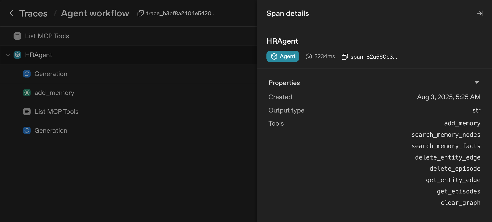
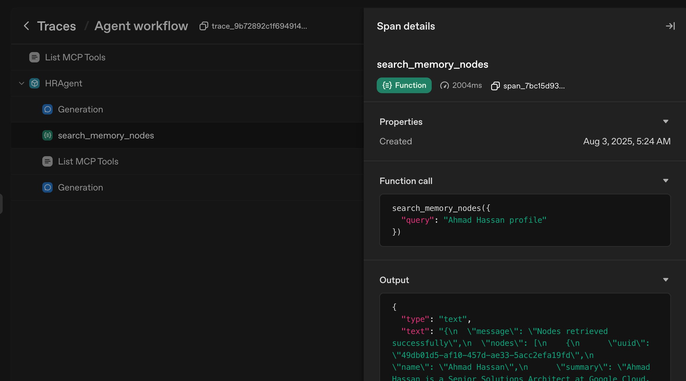

# Step 5: From Temporal KG Theory to Practice with [Graphiti](https://help.getzep.com/graphiti/getting-started/overview)

## The Journey So Far

In Steps 1-3, you discovered:
- **Step 1**: Why agents need different types of memory
- **Step 2**: How various storage systems work (vector, relational, knowledge graphs)
- **Step 3**: How temporal knowledge graphs track relationships and changes over time

**Now the key question**: How do you actually build this for real agents?

## The Challenge: Theory vs. Implementation

You now understand that temporal knowledge graphs are powerful for agent memory. But implementing them from scratch would require:

- Complex graph database programming
- Entity extraction and relationship detection
- Temporal logic and management
- Search and retrieval systems

**What if all this complexity could be hidden behind simple tools?**

## The Solution: [Graphiti - Knowledge Graph Memory for an Agentic World](https://neo4j.com/blog/developer/graphiti-knowledge-graph-memory/)

[What is Graphiti](https://help.getzep.com/graphiti/getting-started/overview)? Well it is a framework that turns temporal knowledge graph theory into practical tools. It provides an MCP (Model Context Protocol) server that gives agents simple commands to work with sophisticated temporal memory.

Graphiti have shipped an MCP Server for Agentic Applications.

### What [Graphiti MCP Server](https://help.getzep.com/graphiti/getting-started/mcp-server) Does

Graphiti implements everything you learned in Steps 1-3:
- **Temporal knowledge graphs** (Step 3 concepts)
- **Efficient storage and search** (Step 2 systems)  
- **Different memory types** (Step 1 foundations)

All wrapped in simple tools that any agent can use.

> Note: The MCP server here is derived from original graphitic server to use Stateless Streamalble HTTP Transport and gemini as llm and embeddings provider.

## The Simple Tools: Turning Complexity into Simplicity

Instead of complex graph programming, Graphiti's MCP server provides these simple tools:

### Core Memory Tools

**`add_episode`** - Store any experience or information
```python
# Agent stores: "Alice works at Google and loves Italian food"
add_episode(
    name="Team Meeting",
    episode_body="Alice works at Google and loves Italian food",
    source="text"
)
# Graphiti automatically extracts entities and relationships
```

**`search_facts`** - Find relationships between entities
```python
# Agent searches: "Alice food preferences"  
search_facts(query="Alice food preferences")
# Returns: "Alice -LIKES-> Italian food (from Team Meeting episode)"
```

**`search_nodes`** - Find information about specific entities
```python
# Agent searches: "Alice" 
search_nodes(query="Alice")
# Returns: Summary of everything known about Alice
```

**`get_episodes`** - Retrieve recent memories
```python
# Agent asks: "What happened recently?"
get_episodes(last_n=5)
# Returns: Last 5 stored episodes
```

### What Happens Automatically

When you call `add_episode("Alice works at Google and loves Italian food")`:

1. **Entity Extraction**: Alice, Google, Italian food
2. **Relationship Detection**: Alice -WORKS_AT-> Google, Alice -LIKES-> Italian food
3. **Temporal Marking**: Current timestamp, present tense
4. **Graph Storage**: Updates knowledge graph with new information

**The agent doesn't need to understand any of this complexity!**

## Hands-On: See Temporal Memory in Action

Let's [set up Graphiti MCP Server](https://help.getzep.com/graphiti/getting-started/mcp-server) and watch temporal knowledge graphs work in real-time.

### Setup Requirements

- **Neo4j Database**: Graph database to store temporal relationships
- **Google API Key**: For LLM operations (entity extraction, embeddings)
- **Python Environment**: To run the MCP server

### Step 1: Get Neo4j Database

1. Visit **Neo4j AuraDB**: https://neo4j.com/product/auradb/
2. Create free account → New instance → Free tier
3. Copy: **URI**, **username**, **password**
4. Wait 2-3 minutes for instance to start

### Step 2: Configure Environment

Create `.env` file:
```env
NEO4J_URI=neo4j+s://your_instance_uri_here
NEO4J_USER=neo4j
NEO4J_PASSWORD=your_password_here

GOOGLE_API_KEY=your_google_api_key_here
SMALL_LLM_MODEL=gemini-2.5-flash
MODEL_NAME=gemini-2.5-flash
DEFAULT_EMBEDDER_MODEL=embedding-001
```

### Step 3: Start MCP Server

```bash
# In the graphiti_mcp_server directory
uv run python mcp_server.py
```

Success message: `"Graphiti client initialized successfully"`

### Step 4: Test the MCP Server

You can test the Graphiti MCP server using either:

**Option A: Python Client**
Use the provided `python_client.py` with httpx:

```bash
# Run the Python examples
uv run python python_client.py
```

The Python client demonstrates:
- Adding episodes (text, JSON)
- Searching for facts and relationships
- Finding entities and their summaries
- Retrieving recent memories

**Option B: Postman Collection**
Use the provided `postman.json` collection to try the tools manually:

1. **Add an episode**: Store information in the knowledge graph
2. **Search for facts**: Query relationships between entities
3. Try all other Tools

### Step 5: Visualize Your Knowledge Graph

In Neo4J Aura DB Instance now you can query and visualize all data present here:

```cypher
MATCH (n)
OPTIONAL MATCH (n)-[r]->(m)
RETURN n, r, m
```
### Step 6: Integrating with OpenAI Agents SDK

Finally let's connect our Memory MCP Server with OpenAI Agents SDK

1. Keep your MCP Server running and run the python_client.py file.
2. In new terminal switch to agent_connect folder 
3. Setup .env file for this project - optionally add OpenAI Key for tracing.
3. Review main.py - we have OpenAI Agents SDK connecting to an MCP server. 
4. The queries are asking about Cloud Expert and sharing a Hiring update. The Agent can now use MCP Tools to manage memory about them

Sample Response:

```bash
mjs@Muhammads-MacBook-Pro-3 agent_connect % uv run main.py

[AGENT RESPONSE - AHMAD PROFILE]: Ahmad Hassan is a Senior Solutions Architect at Google Cloud. His expertise spans AI/ML, BigQuery, and GCP Architecture. He holds the Google Cloud Professional Architect certification, obtained in 2023.


[AGENT RESPONSE - JAY PROFILE]: I've added Jay's profile to the memory, noting his role as Agent Native Cloud Expert, his position as Senior Cloud Architect at Microsoft Azure, and his expertise in Kubernetes, Azure DevOps, cloud security, and large-scale cloud migrations.
```

Above request traces:





## Complete Tool Reference

For building more sophisticated agents, Graphiti MCP server provides these additional tools:

### Memory Management
- **`add_episode`**: Store text, JSON, or message conversations
- **`get_episodes`**: Retrieve recent episodes by group or time
- **`delete_episode`**: Remove specific memories

### Search & Discovery
- **`search_facts`**: Find specific relationships (entity-to-entity connections)
- **`search_nodes`**: Find entities and their summaries
- **`get_entity_edge`**: Get specific relationship details

### Maintenance & Status
- **`clear_graph`**: Reset the entire knowledge graph
- **`delete_entity_edge`**: Remove specific relationships
- **`get_status`**: Check server and database connection

### Data Formats Supported
- **Text**: Natural language conversations and descriptions
- **JSON**: Structured data (CRM records, user profiles, etc.)
- **Messages**: Chat conversations with user/assistant format

## What You've Learned: Theory Meets Practice

By completing this step, you've:

1. **Connected Concepts to Tools**: Seen how temporal KG theory becomes practical MCP tools
2. **Experienced Automatic Processing**: Watched entities and relationships get extracted automatically
3. **Understood the Bridge**: Seen how complex systems can have simple interfaces
4. **Built Working Memory**: Have a temporal knowledge graph system running locally

### The Complete Learning Journey

```
Step 1: Memory Foundations → Step 2: Storage Systems → Step 3: Temporal Theory → Step 4: Practical Tools
```

You now understand both the theoretical foundation AND have working tools to implement sophisticated agent memory.

## Next Steps: Building Memory-Enabled Agents

With Graphiti MCP server running, you can now:

1. **Connect to OpenAI Agents SDK**: Give your agents persistent, temporal memory
2. **Build Conversational Agents**: That remember and learn from every interaction
3. **Setup your IDEs Unified Memory MCO Server**: That track preferences and adapt over time

The foundation is complete. The tools are ready. **Now let's master Graphiti?**

## Resources

- https://www.youtube.com/watch?v=H2Cb5wbcRzo
- https://blog.futuresmart.ai/building-ai-knowledge-graph-using-graphiti-and-neo4j
- https://help.getzep.com/graphiti/getting-started/overview
- https://help.getzep.com/graphiti/getting-started/quick-start
- https://help.getzep.com/graphiti/getting-started/mcp-server
- https://neo4j.com/blog/developer/graphiti-knowledge-graph-memory/